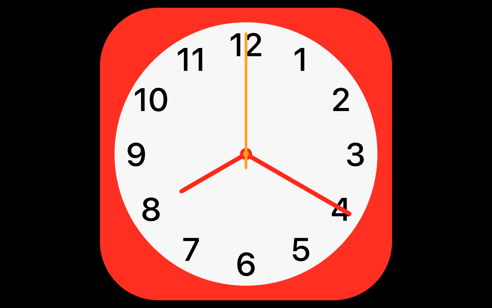
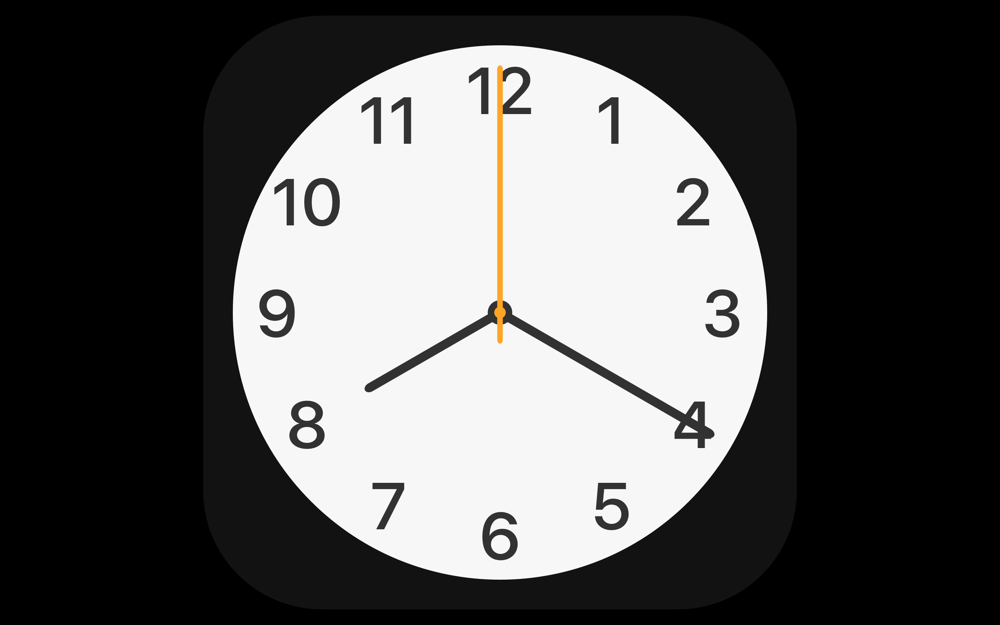

## uClock

uClock is open source, a beauty native Cross Platform Clock Screen Saver for Mac and Windows

In the Chinese New Year 2020, the Sprint Festival, novel coronavirus is spreading in Wuhan, we stay at home for keep safe. Then I developped this native cross platform screen saver program. Expecially adding a Red theme for celebrate the Sprint Festival and pray for the greate medical staff. uClock is a clock screen saver open source, free for personal use, it's UI looks like the clock app in iPhone.

Official website: www.uRyn.tech/uClock

Installation:

* [Download](https://github.com/uRyn/uClock/releases)
* Mac:
  1. Unzip the file uClock_Mac.zip
  2. Double click the unzipped file uClock.saver and confirm to install.

* Windows:
  - For 64-bit:
    1. Unzip the file uClock_Windows_64bit.zip
    2. Copy the unzipped file uClock.scr to OS system path "C:/Windows/System32/", drive "C" is where the Windows installed.
    3. Go to Control Panel and open "Change Screen Saver", then select uClock.
  - For 32-bit:
    1. Unzip the file uClock_Windows_32bit.zip
    2. Copy the unzipped file uClock.scr to OS system path "C:/Windows/System32/", drive "C" is where the Windows installed.
    3. Go to Control Panel and open "Change Screen Saver", then select uClock.
